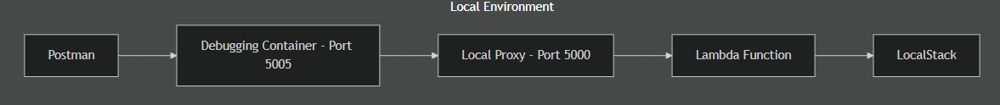
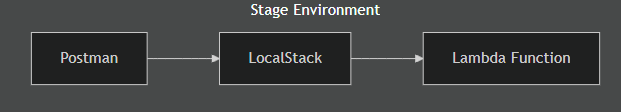

# Infrastructure as Code - Sample Project 

<!-- Three logos row: LocalStack, AWS, Python -->
<div style="display: flex; justify-content: space-around; align-items: center; flex-wrap: wrap; margin: 20px 0;">

  <div style="text-align: center; margin: 10px;">
    <a href="https://github.com/localstack/localstack" target="_blank" rel="noopener noreferrer">
      
    </a>
    <div style="font-size: 0.9em; margin-top: 6px;">LocalStack</div>
  </div>

  <div style="text-align: center; margin: 10px;">
    <a href="https://aws.amazon.com/" target="_blank" rel="noopener noreferrer">
      
    </a>
    <div style="font-size: 0.9em; margin-top: 6px;">Amazon Web Services</div>
  </div>

  <div style="text-align: center; margin: 10px;">
    <a href="https://www.python.org/" target="_blank" rel="noopener noreferrer">
      
    </a>
    <div style="font-size: 0.9em; margin-top: 6px;">Python</div>
  </div>

</div>


## Fibonacci Lambda with SecretsManager (Infrastructure as Code)

This project demonstrates the use of **Infrastructure as Code (IaC)** to fully manage AWS resources locally and remotely using [LocalStack](https://github.com/localstack/localstack) and .NET 8.  
The sample deploys a Lambda function that computes Fibonacci numbers, integrates with AWS Secrets Manager, and exposes an API Gateway endpoint — all managed via code.

---


## 🛠️ Setup Development (Windows)

### 🔧 1. Install Dependencies
1. 🐧 Install [WSL2](https://learn.microsoft.com/en-us/windows/wsl/install) --  Run the following in a **new PowerShell terminal**
```powershell
    wsl --install
```
2. 📦 Install [Scoop](https://scoop.sh/)-- Check website for latest version/instructions --  Run the following in a **new PowerShell terminal**
```powershell
    Set-ExecutionPolicy -ExecutionPolicy RemoteSigned -Scope CurrentUser
    Invoke-RestMethod -Uri https://get.scoop.sh | Invoke-Expression
```
3. 🌱 Install [Git](https://git-scm.com/downloads/win)
```powershell
scoop install git
```
4. 📝 Install [VSCode](https://code.visualstudio.com/docs/?dv=win64user)
```powershell
scoop bucket add extras
scoop install vscode
```
5. 🐳 Install [Docker Desktop](https://docs.docker.com/desktop/setup/install/windows-install/)
6. 🐍 Install Python
```powershell
scoop install python
```
7. ⚡Install [.NET 8 SDK](https://dotnet.microsoft.com/en-us/download/dotnet/thank-you/sdk-8.0.414-windows-x64-installer)

8. 
---

python_dotenv
click
zipfile


## Key Concepts

This example shows the benefits of IaC:

- **Automated Infrastructure**: All AWS resources (Lambda, API Gateway, Secrets Manager) are provisioned through code, no manual clicks in the console.
- **Reproducibility**: Deploy the same environment locally or in the cloud, consistently.
- **Versioning**: Infrastructure definitions can live alongside your application code in Git.
- **Testability**: LocalStack allows full local testing of your AWS stack before production deployment.

---

## Infrastructure as Code (IaC) - `infrastructure/`

- **Python Scripts** (`infrastructure/run_local_cloud.py`):  
  Automates LocalStack deployment, Lambda creation, API Gateway setup, Secrets creation.
  
- **Docker Compose** (`infrastructure/docker-compose.yml`):  
  Defines containers for LocalStack, Lambda debug container, networking, and environment variables.

- **Dockerfile.debug**:  
  Builds the Lambda container for local debugging.

- **localstack_lib**:  
  Core IaC logic to create secrets, Lambda functions, and API Gateway endpoints programmatically.

> ✅ Everything that would normally be manual in AWS is now fully automated and versioned.

---

## Environments

This project supports multiple environments, each configured via **IaC** and environment variables. The environment affects:

- Secrets management
- Lambda behavior (debug/logging)
- API Gateway endpoints
- Any environment-specific configuration

---

### Supported Environments
| Environment | IAC_ENVIRONMENT (ENV Variable) | Description |
|------------|----------------|-------------|
| Local      | `local`        | Full local development using LocalStack. Enables debugging and extra logging. |
| Stage      | `stage`        | Pre-production environment. Simulates production with development settings (LocalStack). |
| Production | `production`   | Live environment on AWS. Uses real secrets and optimized Lambda settings. |

<div style="text-align: center;">
  
</div>

<div style="text-align: center;">
  
</div>


--- 
### Expected Behavior by Environment

| Setting | Local | Stage | Production |
|---------|-------|-------|------------|
| Lambda Debug Mode | ✅ | ❌ | ❌ |
| Fetch Secrets From | LocalStack | LocalStack | AWS Secrets Manager |
| Logging | Verbose | Standard | Minimal / Optimized |
| API Gateway | Localhost | LocalStack | Production URL |
| Deployment | `docker-compose + LocalStack` | IaC scripts → AWS | IaC scripts → AWS |
